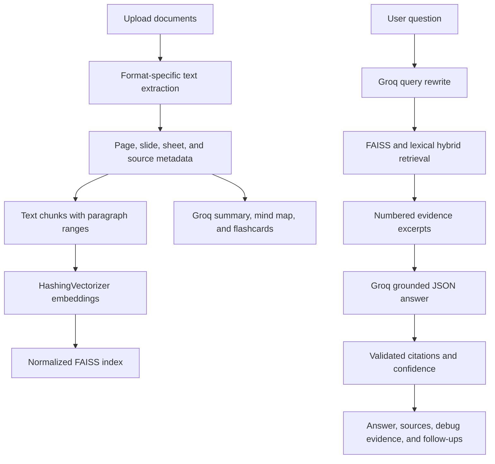

# Smart Document Assistant

A Streamlit document assistant that lets users upload documents, search them with natural-language questions, and receive grounded answers with source citations. It also provides summaries, visual mind maps, and study flashcards.

## Problem Understanding

People often need answers from their own documents, but ordinary chatbots can either miss relevant passages or confidently invent information. This project addresses that problem by retrieving text from uploaded documents first, asking the language model to answer only from those excerpts, and showing the exact source passages used.

When the retrieved evidence is weak, the application refuses to invent an answer. Instead, it reports that the information was not found and offers document-grounded topic suggestions to help the user repair the query.

## Features

- Natural-language questions over one or multiple uploaded documents.
- ChatGPT-style conversation history with editable follow-up questions.
- Answer confidence and evidence-strength indicators.
- Inline citations such as `[1]` mapped to source excerpts.
- Source filename plus page, slide, or sheet metadata when available.
- Debug view showing retrieved passages and whether each was cited.
- Query repair suggestions for low-confidence searches.
- Document summaries.
- Flowchart-style mind maps.
- Grounded flashcards.
- Support for PDF, DOCX, PPTX, XLS/XLSX/XLSM, CSV/TSV, JSON, HTML, Markdown, TXT, LOG, RTF, and other UTF-8 text files.

## Architecture

The application currently lives in `app.py` and runs as a direct Streamlit script.



### Data flow

1. The Streamlit frontend accepts one or more document uploads and user questions.
2. Format-specific extractors read supported files and preserve page, slide, sheet, and source metadata.
3. `split_text()` creates text chunks with paragraph ranges for traceable citations.
4. `HashingVectorizer` creates deterministic local embeddings, which are normalized and stored in the FAISS index.
5. Groq rewrites each user question before the retriever combines FAISS similarity with lexical term overlap.
6. The retriever produces numbered evidence excerpts for the grounded answer request.
7. Groq returns a JSON answer grounded only in those excerpts.
8. The response parser validates citations, confidence, evidence, and follow-up questions before displaying them.
9. Extracted document text can also be sent to Groq for summaries, mind maps, and flashcards.

## Technology Choices

- **Streamlit:** Provides the interactive Python UI, upload controls, tabs, chat messages, forms, and session state with minimal application overhead.
- **Groq:** Provides fast hosted chat completion for question rewriting, grounded answers, summaries, mind maps, flashcards, and query repair.
- **FAISS:** Provides efficient similarity search over document chunks.
- **scikit-learn `HashingVectorizer`:** Creates deterministic local retrieval vectors without requiring a separate embedding server or embedding API.
- **pypdf:** Extracts text and page numbers from PDFs.
- **python-docx, openpyxl, xlrd:** Extract text from Word and Excel documents.
- **Standard-library ZIP/XML parsing:** Extracts PowerPoint slide text without requiring the Pillow-dependent PowerPoint import at application startup.
- **BeautifulSoup:** Extracts readable text from HTML documents.

## How to Run

### 1. Create or activate the virtual environment

PowerShell on Windows:

```powershell
python -m venv .venv
.\.venv\Scripts\Activate.ps1
```

### 2. Install dependencies

```powershell
python -m pip install streamlit groq faiss-cpu numpy pypdf scikit-learn python-docx python-pptx openpyxl xlrd beautifulsoup4
```

The application avoids importing the Pillow-dependent PowerPoint package at startup, but `python-pptx` can remain installed for environments where it is useful.

### 3. Configure Groq

Use an environment variable for a local session:

```powershell
$env:GROQ_API_KEY = "your-groq-api-key"
$env:GROQ_MODEL = "openai/gpt-oss-20b"
```

Or create `.streamlit/secrets.toml`:

```toml
GROQ_API_KEY = "your-groq-api-key"
GROQ_MODEL = "openai/gpt-oss-20b"
```

The repository includes `.streamlit/secrets.toml.example` as a template. Copy it to `secrets.toml` and replace the placeholder locally.

### 4. Start the app

```powershell
streamlit run app.py
```

The default local URL is `http://localhost:8501`.

## AI Tools Used

- **GitHub Copilot / ChatGPT:** Assisted with implementation, debugging, UI iteration, retrieval design, citation validation, and documentation.
- **Groq:** Used at runtime for query rewriting, grounded answer generation, summaries, query-repair suggestions, mind maps, flashcards, and follow-up questions.
- **FAISS and local vectorization:** Used for retrieval; these are deterministic application components rather than generative AI services.

No Claude or Gemini API is required by the application.

## Known Limitations

- Scanned or image-only PDFs do not produce text unless OCR is added.
- Unknown binary file formats cannot be reliably interpreted; unknown text formats are attempted as UTF-8.
- Very large documents may exceed model context or take longer to process because document text is sent to generation features.
- Retrieval quality depends on extracted text quality and the local hashing vector representation.
- Confidence and evidence scores are model-generated signals supported by retrieval similarity; they are not formal probabilities.
- Conversation history and generated artifacts are stored in Streamlit session state and are not persistent across server restarts.
- Groq model availability depends on the API key and current provider catalog. The app checks available models and supports `GROQ_MODEL` overrides.
- Mind maps and flashcards are generated from document text, but their structure and phrasing still depend on the selected Groq model.
- The application does not provide authentication or multi-user data isolation beyond Streamlit's runtime session behavior.

## Security and Secrets

Never commit API keys, passwords, tokens, or other secrets.

- Keep `.streamlit/secrets.toml` local and outside version control.
- Use `.streamlit/secrets.toml.example` only as a placeholder template.
- Rotate any API key that has been exposed in chat, logs, screenshots, or source files.
- Do not put real credentials in `README.md`, `app.py`, or example configuration files.
