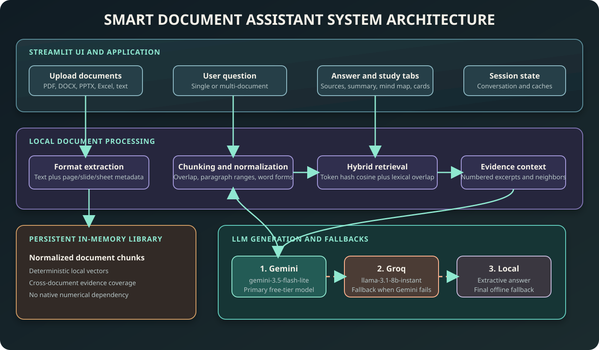

# Smart Document Assistant

A Streamlit document assistant that lets users upload documents, search them with natural-language questions, and receive grounded answers with source citations. It also provides summaries, visual mind maps, and study flashcards.

## Problem Understanding

People often need answers from their own documents, but ordinary chatbots can either miss relevant passages or confidently invent information. This project addresses that problem by retrieving text from uploaded documents first, asking the language model to answer only from those excerpts, and showing the exact source passages used.

When the retrieved evidence is weak, the application refuses to invent an answer. Instead, it reports that the information was not found and offers document-grounded topic suggestions to help the user repair the query.

## Features

- Natural-language questions over one or multiple uploaded documents.
- ChatGPT-style conversation history with editable follow-up questions.
- Answer confidence and evidence-strength indicators.
- Inline citations such as `[1]` mapped to source excerpts.
- Source filename plus page, slide, or sheet metadata when available.
- Debug view showing retrieved passages and whether each was cited.
- Query repair suggestions for low-confidence searches.
- Document summaries.
- Flowchart-style mind maps.
- Grounded flashcards.
- Support for PDF, DOCX, PPTX, XLS/XLSX/XLSM, CSV/TSV, JSON, HTML, Markdown, TXT, LOG, RTF, and other UTF-8 text files.

## Architecture

The application currently lives in `app.py` and runs as a direct Streamlit script. Gemini Flash-Lite is the primary generation provider, Groq is the optional LLM fallback, and local extraction is the final fallback.



### Data flow

1. The Streamlit frontend accepts one or more document uploads and user questions.
2. Format-specific extractors read supported files and preserve page, slide, sheet, and source metadata.
3. `split_text()` creates text chunks with paragraph ranges for traceable citations.
4. Deterministic local token-hash vectors are normalized and kept in memory for cosine-similarity search.
5. The retriever combines vector similarity with lexical term overlap for differently worded questions and keeps coverage across documents.
6. The retriever produces numbered evidence excerpts for the grounded answer request.
7. Gemini `gemini-3.5-flash-lite` receives the evidence and returns a grounded JSON answer.
8. If Gemini is unavailable or rate-limited, Groq `llama-3.1-8b-instant` is tried automatically.
9. If both providers fail, a local extractive answer uses the strongest retrieved sentences.
10. The response parser validates citations, confidence, evidence, and follow-up questions before displaying them.
11. Extracted document text can also be sent through the same provider fallback chain for summaries, mind maps, and flashcards.

## Technology Choices

- **Streamlit:** Provides the interactive Python UI, upload controls, tabs, chat messages, forms, and session state with minimal application overhead.
- **Google AI Studio Gemini REST API:** Primary provider. `gemini-3.5-flash-lite` is selected by default for high-throughput, free-tier-friendly use; set `GEMINI_MODEL` to override it. The app uses Python's standard-library HTTP client, avoiding an SDK binary dependency.
- **Groq REST API:** Optional LLM fallback when Gemini is unavailable or rate-limited. Configure `GROQ_API_KEY` and optionally `GROQ_MODEL` to enable it.
- **Pure-Python retrieval:** Uses deterministic token hashing and cosine similarity without a separate embedding server or native numerical libraries.
- **pypdf:** Extracts text and page numbers from PDFs.
- **python-docx, openpyxl, xlrd:** Extract text from Word and Excel documents.
- **Standard-library ZIP/XML parsing:** Extracts PowerPoint slide text without requiring the Pillow-dependent PowerPoint import at application startup.
- **BeautifulSoup:** Extracts readable text from HTML documents.

## How to Run

### 1. Create or activate the virtual environment

PowerShell on Windows:

```powershell
python -m venv .venv
.\.venv\Scripts\Activate.ps1
```

### 2. Install dependencies

```powershell
python -m pip install -r requirements.txt
```

The application uses pure-Python retrieval and does not require NumPy, FAISS, scikit-learn, or an LLM SDK.

### 3. Configure Google AI Studio

Use an environment variable for a local session:

```powershell
$env:GOOGLE_AI_STUDIO_KEY = "your-google-ai-studio-key"
$env:GEMINI_MODEL = "gemini-3.5-flash-lite"
$env:GROQ_API_KEY = "your-groq-api-key"
$env:GROQ_MODEL = "llama-3.1-8b-instant"
```

Or create `.streamlit/secrets.toml`:

```toml
GOOGLE_AI_STUDIO_KEY = "your-google-ai-studio-key"
GEMINI_MODEL = "gemini-3.5-flash-lite"
GROQ_API_KEY = "your-groq-api-key"
GROQ_MODEL = "llama-3.1-8b-instant"
```

The repository includes `.streamlit/secrets.toml.example` as a template. Copy it to `secrets.toml` and replace the placeholder locally.

### 4. Start the app

```powershell
streamlit run app.py
```

The default local URL is `http://localhost:8501`.

## AI Tools Used

- **GitHub Copilot / ChatGPT:** Assisted with implementation, debugging, UI iteration, retrieval design, citation validation, and documentation.
- **Google AI Studio Gemini:** Used first at runtime for grounded answer generation, summaries, mind maps, flashcards, and follow-up questions.
- **Groq:** Used as an optional runtime LLM fallback when Gemini fails or reaches its rate limit.
- **Local token hashing and cosine similarity:** Used for retrieval and as the final answer fallback; these are deterministic application components rather than generative AI services.

Claude is not required by the application. Groq is optional when Gemini is configured.

## Known Limitations

- Scanned or image-only PDFs do not produce text unless OCR is added.
- Unknown binary file formats cannot be reliably interpreted; unknown text formats are attempted as UTF-8.
- Very large documents may exceed model context or take longer to process because document text is sent to generation features.
- Retrieval quality depends on extracted text quality and the local hashing vector representation.
- Confidence and evidence scores are model-generated signals supported by retrieval similarity; they are not formal probabilities.
- Conversation history and generated artifacts are stored in Streamlit session state and are not persistent across server restarts.
- Gemini and Groq model availability depends on each provider's current catalog and account limits. The app supports `GEMINI_MODEL` and `GROQ_MODEL` overrides.
- Free-tier RPM, TPM, and RPD limits vary by provider project and model; check each provider's dashboard before relying on a quota.
- Mind maps and flashcards are generated from document text, but their structure and phrasing still depend on the selected Gemini model.
- The application does not provide authentication or multi-user data isolation beyond Streamlit's runtime session behavior.

## Security and Secrets

Never commit API keys, passwords, tokens, or other secrets.

- Keep `.streamlit/secrets.toml` local and outside version control.
- Use `.streamlit/secrets.toml.example` only as a placeholder template.
- Rotate any API key that has been exposed in chat, logs, screenshots, or source files.
- Do not put real credentials in `README.md`, `app.py`, or example configuration files.
